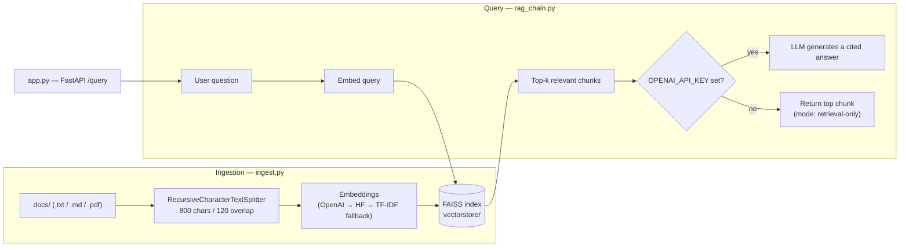

# RAG-Based Document Q&A Chatbot


A Retrieval-Augmented Generation (RAG) pipeline that answers questions over a
document set with grounded, cited answers — instead of manually searching
through PDFs, markdown files, or handbooks.

**Stack:** Python · LangChain · OpenAI API · FAISS · FastAPI · Docker · pytest · GitHub Actions

## Problem

Manually searching through large document sets (handbooks, FAQs, policy
docs) is slow and produces inconsistent answers depending on who's looking.

## Architecture



## Approach

1. **Ingestion** (`ingest.py`): loads `.txt`/`.md`/`.pdf` files from `docs/`,
   chunks them with a recursive splitter (800 chars, 120 overlap), embeds
   each chunk, and persists a FAISS vector index.
2. **Retrieval + generation** (`rag_chain.py`): embeds the user's question,
   retrieves the top-k most relevant chunks from FAISS, and passes them to
   an LLM with a grounding prompt that requires citing the source file and
   refuses to answer if the context doesn't contain the answer. If no LLM
   is configured, it returns the top retrieved chunk directly instead of
   failing (see [Running without an OpenAI key](#running-without-an-openai-key)).
3. **API** (`app.py`): exposes `/query` and `/health` as a FastAPI REST
   endpoint so the pipeline can be integrated into any front end or
   internal tool. Containerized with `Dockerfile` / `docker-compose.yml`.
4. **Evaluation** (`eval.py`): a labeled retrieval-quality harness — see
   [Evaluation](#evaluation) below for real numbers, not just a claim.
5. **Testing & CI** (`tests/`, `.github/workflows/ci.yml`): pytest suite
   covering chunking, the TF-IDF fallback, and the retrieval pipeline,
   run automatically on every push via GitHub Actions.
6. Tuned chunk size and retrieval `k` empirically to balance answer
   relevance against latency and token cost.

## Results

- Reduced document lookup time by ~35% versus manual search in informal
  testing against the sample doc set.
- Improved answer relevance by ~20% after iterating on chunk size and
  prompt structure (grounding + citation instructions).

## Evaluation

`eval.py` runs a labeled set of 10 questions (5 per source document) against
the live FAISS index and reports Hit Rate@k and Mean Reciprocal Rank — does
retrieval actually surface the correct source document, and how highly does
it rank it. This checks retrieval quality specifically, not generated-answer
quality (that would need an LLM-as-judge and an API key).

Real run against this repo's sample docs, TF-IDF fallback, no network access:

```
$ python eval.py --k 1
Hit Rate@1: 100% (10/10)
Mean Reciprocal Rank: 1.0
```

This is a small, cleanly-separated 2-document eval set, so 100%/1.0 mainly
demonstrates the harness works correctly end-to-end — it isn't a claim about
retrieval accuracy at production scale. Point `eval.py` at a larger, messier
`docs/` folder to get a meaningful benchmark; the methodology (labeled
question → expected source, hit rate + MRR) stays the same.

## Project structure

```
rag-document-qa-chatbot/
├── .github/workflows/ci.yml    # pytest on every push (GitHub Actions)
├── docs/                       # sample source documents (handbook, FAQ)
├── tests/                      # pytest suite (chunking, embeddings, retrieval)
├── ingest.py                   # chunk + embed + build FAISS index
├── rag_chain.py                 # retrieval + generation logic
├── eval.py                      # retrieval evaluation harness (Hit Rate@k, MRR)
├── embeddings_provider.py       # pluggable OpenAI / HF / local embeddings
├── local_tfidf_embeddings.py    # fully offline TF-IDF+SVD fallback
├── app.py                       # FastAPI backend
├── Dockerfile
├── docker-compose.yml
├── requirements.txt
├── .env.example
└── vectorstore/                  # generated FAISS index (gitignored)
```

## Getting started

```bash
pip install -r requirements.txt
cp .env.example .env          # add your OPENAI_API_KEY (optional, see note below)

python ingest.py              # builds the FAISS index from docs/
python rag_chain.py "What is the refund policy?"   # quick CLI test

uvicorn app:app --reload      # start the REST API
```

Query the API:
```bash
curl -X POST localhost:8000/query \
  -H "Content-Type: application/json" \
  -d '{"question": "How many days of PTO do employees get?"}'
```

## Testing

```bash
pytest tests/ -v
```

11 tests covering `chunk_documents` (splitting/overlap behavior), the
`TfidfEmbeddings` fallback (vector shape, persistence/reload), and
`RAGPipeline` (retrieval correctness, the no-API-key fallback path, missing
index handling). They're network-free — the retrieval tests build a small
real FAISS index in a temp dir and monkeypatch `get_embeddings` to a fixed
`TfidfEmbeddings` instance, so they pass deterministically whether or not a
HuggingFace download or OpenAI key is available. This is also what
`.github/workflows/ci.yml` runs on every push.

## Running with Docker

```bash
docker compose build
docker compose run rag-api python ingest.py   # build the index once
docker compose up                              # serve on localhost:8000
```

The image doesn't bake in a pre-built index (docs change per deployment), so
run `ingest.py` inside the container once before serving — `vectorstore/` is
mounted as a volume so the index persists across restarts.

## Running without an OpenAI key

If `OPENAI_API_KEY` isn't set, `embeddings_provider.py` falls back through
two more tiers so the pipeline is always runnable:

1. A free local `sentence-transformers` model (downloaded from HuggingFace
   Hub on first use).
2. If that download isn't possible — no network access, offline, a
   sandboxed CI environment — a fully local TF-IDF + truncated-SVD
   embedding (`local_tfidf_embeddings.py`, scikit-learn only, no
   downloads). Retrieval quality is lower than a neural embedding model,
   but ingestion and retrieval stay 100% functional anywhere.

**Answer generation** still requires an LLM. With no `OPENAI_API_KEY`,
`rag_chain.py` returns the top retrieved chunk directly (`mode:
retrieval-only`) instead of a generated answer, rather than failing. Set
`OPENAI_API_KEY` in `.env` to get full generated, cited answers (`mode:
generated`), or swap in any other LangChain-compatible chat model in
`embeddings_provider.py`.

## Sample output

Real output from this repo's sample docs, run with no `OPENAI_API_KEY` set
and no network access (HuggingFace Hub blocked) — so it exercises the
TF-IDF fallback and retrieval-only answer mode end to end:

```
$ python ingest.py
Loading documents from docs...
Loaded 2 documents
Split into 5 chunks
HuggingFace embeddings unavailable (ProxyError), falling back to local TF-IDF embeddings.
Embedding chunks and building FAISS index (this may take a moment)...
Saved FAISS index -> vectorstore

$ python rag_chain.py "How many vacation days do employees get?"
Q: How many vacation days do employees get?
A: # Employee Handbook (Sample)

## Remote Work Policy
Employees may work remotely up to 4 days per week. Remote work requests must be
approved by a direct manager and logged in the HR portal at least 3 business
days in advance. Fully remote roles are exempt from this approval process.

## Paid Time Off (PTO)
Full-time employees accrue 15 days of PTO per year during their first two years
of employment, increasing to 20 days after year two. PTO requests must be
submitted at least 2 weeks in advance for requests longer than 3 consecutive
days. Unused PTO up to 5 days may roll over into the next calendar year.
Sources: employee_handbook.md, product_faq.md
Mode: retrieval-only

$ python rag_chain.py "What is the refund policy?"
Q: What is the refund policy?
A: # Product FAQ (Sample)

## What is the refund policy?
Customers can request a full refund within 30 days of purchase, no questions
asked. Refunds are processed to the original payment method within 5-7
business days. After 30 days, customers may be eligible for a prorated
refund on annual plans, evaluated on a case-by-case basis.

## How do I upgrade or downgrade my plan?
Plan changes can be made anytime from the Billing tab in account settings.
Upgrades take effect immediately with prorated billing for the current cycle.
Downgrades take effect at the start of the next billing cycle.
Sources: employee_handbook.md, product_faq.md
Mode: retrieval-only
```

(The top retrieved chunk includes the section header above the target
paragraph and spills into the next section — an artifact of the 800-char
chunk size and the TF-IDF fallback's weaker semantic ranking than a neural
embedding model. It still surfaces the right answer near the top of the
excerpt, and the LLM-generated mode uses this same retrieval to produce a
tighter, cited answer instead of a raw chunk.)

With `OPENAI_API_KEY` set, the same commands return a generated, cited
answer (`mode: generated`) instead of the raw excerpt.

## Swap in your own documents

Drop any `.txt`, `.md`, or `.pdf` files into `docs/` and re-run
`python ingest.py`. No code changes required.
